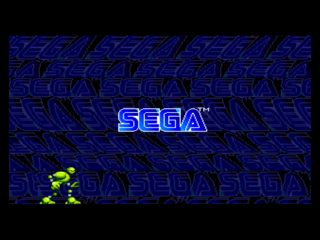

# An inside look at Sega Genesis Collections
Today we'll be looking at three games: Sega Genesis Collection for PlayStation 2, Sega Genesis Collection for PlayStation Portable, and Sonic's Ultimate Genesis Collection for PlayStation 3.
## The folder structures
### PlayStation 2
We have the root directory:

* 0APRP310.IMG is a standard PS2 reset file. Okay, I don't actually know that for sure, but it's a binary .IMG file starting with the string "RESET" that I find in almost every PS2 game I examine.
* SLUS_215.42 is a standard PS2 ELF executable found in every game. We'll touch more on this later.
* SYSTEM.CNF contains boot information in plaintext. It points to the above file as the main executable and specifies the region and version of the game.
* 0B has two important files: SEGA_FFE.SR and SEGA_FW.SR. More on that later.
* 0CLASSIC has three subfolders representing alphabetical divisions of A-E, F-R, and S-Z. This is where the games' archive files are found. Again, we will return to this.
* 0VIDEOS has the EXTRAS and OTHER subfolders. The former is a collection of the game's interviews; the latter is for miscellaneous things such as splash logos and the credits. These video files are in .PSS format, the standard for full-motion video on PlayStation 2.
* The last three folders match what is found in the 0CLASSIC folder. Except, instead of archive files, they are all ELF files! As mentioned before, ELF is the executable for PlayStation. How interesting.
### PlayStation Portable
The PSP version is mostly the same, albeit minor differences.

* These files are not in the root directory, but in the USRDIR folder. The root directory contains system files for the PSP.
* The videos within 0VIDEOS are nearly identical to those found in the PS2 version, but they are in .PMF format. This is the case with any video for PSP.
* There is a .PRX file for every game in this folder. If you were to examine its contents, you would see the familiar ELF header.
### PlayStation 3
This is where things get different. The PS3 "version" is in fact different software with some of the same games. However, it is made by mostly the same people. The differences could offer insight into the development of its predecessor.

* Like the PSP version, this is not the root directory. The root contains system files.
* "fmv" contains video files. Curiously, they're not divided into subfolders for interviews and miscellaneous as with the other versions; they are all together. They are .MP4 files as well rather than a proprietary Sony format.
* In "sounds" you will find a "music" folder containing a single file, retro_dreams.msf. This is presumably an archive of music files for PS3. I have yet to find a way to extract its contents.
* "streams" has two files, global_binary.spr and ui.spr. Again, their contents are a mystery to me.
* EBOOT.BIN is your typical PS3 boot file.
* The two .FPG files are also archive files which I cannot peak into.
* pad.file is weird. It's a large file, but its contents are just the null character over and over. Given its name and contents, I would say it serves as padding to fill out the disc space.

## .SR archives
When I first popped open the PS2 copy of Sega Genesis Collection, I was looking for one simple thing: the awesome music from the main menu. It's the only song of the collection itself, so there was no official soundtrack release. Best I could find was compressed recordings on YouTube from years ago. Sadly, nothing in the file structure stood out as a music file, but I went and examined things in a text editor anyway. Maybe I'd find some secrets. Well, I did.

Say, the contents of the SEGA_FFE.SR file look interesting. The beginning of the file is a regular list, with some binary junk after it. It's like some sort of archive. The first number is slightly bigger than the first number from the previous line. The last bit part of a line is obviously a filename. Oh, and the 44100? I recognize that number. It's a standard sampling frequency for audio data. And it's found on the same line as... a .WAV file!

Every .SR file is laid out the same way:
* First line containing the number of files, the number 80, and the byte offset to the start of the raw data
* Lines for individual files with the byte offset to the file data, the size of the file in bytes, three special numbers, then the filename. For most files the special numbers are 100 and two 0s. Those don't seem to be useful. For audio files, however, the special numbers represent the number of channels, the sampling frequency, and the bit depth. The data in the header of .SR archive contains information that should go in the header of a .WAV file.

## Files within .SR archives
[I wrote an extractor for files from .SR archives](https://github.com/garretbs/SR-Extractor). I really wanted that music, you know. Let's take a look at what we find in SEGA_FW.SR:

* The .WAV files are just the sounds you here when moving around in the menus.
* Presumably, the .IA files are icon graphics for the PS2 controller's buttons, though I haven't been able to figure out its header to find more information. They all share the same first few characters
* There various files without an extension (the file list was too large to be shown here). These have that same ELF header yet again. Curiously, trying to boot them individually in PCSX2 causes a memory error.
* The PSP version's SEGA_FW.SR has mostly the same contents. The "ps2_*.ia" files instead have "psp_*.ia" filenames. The extensionless ELF files are missing as well.

SEGA_FFE.SR contains the real meat. Finally, we begin to see some insight into how this collection really runs.

* BG.M2V is a video file. It is what appears in the background of the menus. It's just a small looping blue background. In the PSP version, it uses the .PMF format.
* There are various .SWF files representing the menus. That's right, the interactive menus are just flash files being played on PS2.
* There are multiple .IA files per game here. I do not believe it is data from the games themselves, but rather metadata for the collection. The menus show text detailing the background behind the games' history.
* The awesome menu music is found here in .WAV format. It even loops perfectly. In the PSP version, it is .AT3. That was the standard audio format for portable Sony devices.
* The PSP version has .SWF files pertaining to its custom menus, such as multiplayer connectivity.

### Files within .SR archives for games

Now we are at the fulcrum of where things get truly interesting. What files will we find in the .SR archive for a game? Let's take a quick peek at Vectorman (it's a good game by the way, consider giving it a try).

* ic_VECTMAN.PNG can be plainly opened in anything that supports PNG images. It's the icon you see in the menu when selecting the game. Given its filename, we can assume that files named ic_*.IA contain icon data.
* The audio data is curious. It's simply audio data from the game itself, sound effects and music. On the PS2 version, the lowercase .wav files are sound effects, and .WAV in uppercase with a lowercase m in the filename is for music. The PSP version uses .wav for sound effects and .AT3 for music. And a bonus: the music files in the PSP version actually have a higher sampling rate than their PS2 counterparts! They clock in with 44100 Hz, whereas PS2's game music kept it down to 22050 Hz.
* The file I suspiciously skipped over, VECTMAN.68k.QZ, gives us a clue as to what it is in its filename. 68k is the shorthand for the Motorola 68000, the CPU for the Sega Genesis. .68K is also the file extension for Genesis ROMs as found in [Sega Mega Drive and Genesis Classics](https://store.steampowered.com/app/34270/SEGA_Mega_Drive_and_Genesis_Classics/) on Steam. So presumably these .68k.QZ files are Genesis ROMS, right? Well, probably. Let's dedicate a section to what we'll find.

### .68k.QZ files
These are most likely Genesis ROMs. What do they have in common?
* Similar naming scheme. Vectorman is named VECTMAN in both Sega Genesis Classics and the Steam version
* 68k in filename
What's different?
* Steam files are directly playable in emulator. PS2/PSP files are not.
* File sizes are different. VECTMAN_UE.68K in Steam comes in at 2048kB. VECTMAN.68k.QZ is only 1026kB. ROMs from Steam are stored in a folder named "uncompressed ROMs."
* Steam ROMs include plaintext information in the header. PS2/PSP ROMs are just raw binary.

## Directly booting the executables
Recall what I said way back near the beginning when talking about folder structures. For each game in Sega Genesis Collection exists one .ELF file (.PRX on PSP, but still has ELF header). That is an executable. What happens if we try to, well, execute one?

 

It boots directly to the control prompt in PCSX2, which then opens the game! What if we try opening VECTMAN.PRX in PPSSPP?!?!?!?!?

Oh. It fails to find the proper files. I am not sure if this is reflective of changes in design or simple a fault on the emulator.

## Some last things, then we get to the interesting part I promise
I've dumped a lot of information on you so far. The payoff is soon. We just have some miscellaneous last bits of evidence to examine.

* Unique to the PS2/PSP collection are weird audio issues. These aren't simple glitches. When you get speed shoes in the two Sonic games, the music does not speed up like it should. The special stage music doesn't play at all. Some sound effects in Ristar are completely different from what they should be. Other Genesis compilation releases have no unique game glitches that I know of
* Sonic the Hedgehog 3 is mysteriously absent in the PS2/PSP versions, but not the PS3 version. Note that Sonic 3 (& Knuckles) has notorious legal issues that prevent it from being released with alterations in any way. It only appears in forms of raw emulation. Pick any rerelease including Sonic 3, and you will find that it is 1:1 with the original game. Pick any rerelease compilation with some new features—3D Genesis titles on 3DS, Sega Genesis Classics with online functionality on PS4/XB1/PC—and Sonic 3 will be missing.

And to review:

* The audio files are plainly laid out in Sega Genesis Collection
* The PS2/PSP versions have executables for each game. So far, I have found no evidence of the same in the PS3 version

### So what?
So what? SO WHAT? So... I think the games in Sega Genesis Collection are not emulated, but run natively.

#### What?
Yeah.

#### Do you know that for sure?
Well, no. I could be totally wrong.