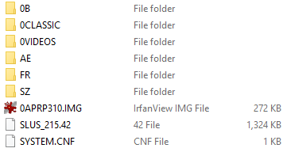

# An inside look at Sega Genesis Collections
Today we'll be looking at three games: Sega Genesis Collection for PlayStation 2, Sega Genesis Collection for PlayStation Portable, and Sonic's Ultimate Genesis Collection for PlayStation 3.
## The folder structures
### PlayStation 2
We have the root directory:

* 0APRP310.IMG is a standard PS2 reset file. Okay, I don't actually know that for sure, but it's a binary .IMG file starting with the string "RESET" that I find in almost every PS2 game I examine.
* SLUS_215.42 is a standard PS2 ELF executable found in every game. We'll touch more on this later.
* SYSTEM.CNF contains boot information in plaintext. It points to the above file as the main executable and specifies the region and version of the game.
* 0B has two important files: SEGA_FFE.SR and SEGA_FW.SR. More on that later.
* OCLASSIC has three subfolders representing alphabetical divisions of A-E, F-R, and S-Z. This is where the games' archive files are found. Again, we will return to this.
* 0VIDEOS has the EXTRAS and OTHER subfolders. The former is a collection of the game's interviews; the latter is for miscellaneous things such as splash logos and the credits. These video files are in .PSS format, the standard for full-motion video on PlayStation 2.
* The last three folders match what is found in the 0CLASSIC folder. Except, instead of archive files, they are all ELF files! As mentioned before, ELF is the executable for PlayStation. How interesting.
### PlayStation Portable
The PSP version is mostly the same, albeit minor differences.

* These files are not in the root directory, but in the USRDIR folder. The root directory contains boot files for the PSP.
* The videos within 0VIDEOS are nearly identical, but they are in .PMF format. This is the case with any video for PSP.
* There is a .PRX file for every game in this folder. If you were to examine its contents, you would see the familiar ELF header.

### PlayStation 3
This is where things get different. The PS3 "version" is in fact mostly different software with some of the same games. However, it is made by mostly the same people. The differences could offer insight into the development of its predecessor.

* Like the PSP version, this is not the root directory. The root contains boot files.
* "fmv" contains video files. Curiously, they're not divided into subfolders for interviews and miscellaneous; they are all together. They are .MP4 files as well rather than a proprietary Sony format.
* In "sounds" you will find a "music" folder containing a single file, retro_dreams.msf. This is presumably an archive of music files for PS3. I have yet to find a way to extract its contents.
* "streams" has two files, global_binary.spr and ui.spr. Again, their contents are a mystery to me.
* EBOOT.BIN is your typical PS3 boot file.
* The two .FPG files are also archive files which I cannot peak into.
* pad.file is weird. It's a large file, but its contents are just the null character over and over. Given its name and contents, I would say it serves as padding to fill out the disc space.

## .SR archives
When I first popped open the PS2 copy of Sega Genesis Collection, I was looking for one simple thing: the awesome music from the main menu. It's the only song of the collection itself, so there was no official soundtrack release. Best I could find was compressed recordings on YouTube from years ago. Sadly, nothing in the file structure stood out as a music file, but I went and examined things in a text editor anyway. Maybe I'd find some secrets. Well, I did.

Say, the contents of the SEGA_FFE.SR file look interesting. The beginning of the file is a regular list, with some binary junk after it. It's like some sort of archive. The first number is slightly bigger than the first number from the previous line. The last bit part of a line is obviously a filename. Oh, and the 44100? I recognize that number. It's a standard sampling frequency for audio data. And it's found on the same line as... a .WAV file!

Every .SR file is laid out the same way:
* First line containing the number of files, the number 80, and the byte offset to the start of the raw data
* Lines for individual files with the byte offset to the file data, the size of the file in bytes, three special numbers, then the filename. For most files the special numbers are 100 and two 0s. Those don't seem to be useful. For audio files, however, the special numbers represent the number of channels, the sampling frequency, and the bit depth. The data in the header of .SR archive contains information that should go in the header of a .WAV file.

## Files within .SR archives